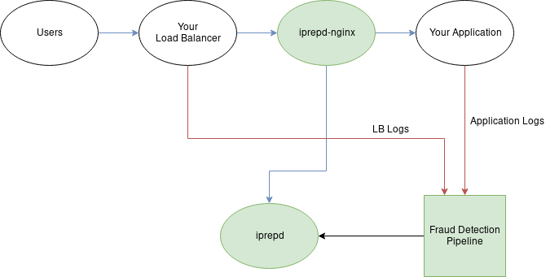

# iprepd-nginx module

`iprepd-nginx` is an openresty module for integrating with [iprepd](https://github.com/mozilla-services/iprepd).

You can use the example configuration in this repo for a standalone proxy or install using [opm](https://github.com/openresty/opm)
and integrate it yourself.

*Note:* If nginx is behind a load balancer, make sure to use something like
[ngx_http_realip_module](https://nginx.org/en/docs/http/ngx_http_realip_module.html).

## What exactly does iprepd-nginx do?

By using the `iprepd` client in `iprepd-nginx`, you can configure nginx to check the reputation of an incoming client IP within `iprepd`. With
this reputation, `iprepd-nginx` will attach up to three HTTP headers on the request that is then forwarded to your application and can reject
requests that are below the configured threshold.

These three headers are:

| Header | Values | Description |
|---|---|---|
| X-Foxsec-IP-Reputation | int (0-100) | Reputation score returned by iprepd |
| X-Foxsec-IP-Reputation-Below-Threshold | boolean ('true'/'false') | Whether the reputation is below the configured threshold |
| X-Foxsec-Block | boolean ('true'/'false') | High-level whether the request should be blocked (subject to change on what this means) |

As well, `iprepd-nginx` is designed to fail open and prefer performance to accuracy. The preference of performance to accuracy can be changed a bit as an
operator, but only to a certain extend (discussed further below).

## Architecture Diagram



## Installation

Install using [opm](https://github.com/openresty/opm)

```
opm get mozilla-services/iprepd-nginx
```

## Operators Guide

### Prerequisites

TODO

### Note on Performance

A core requirement for iprepd-nginx is that it will add no more than 10ms of latency to requests. Of the mechanisms in place to accomplish this, as an operator there are a few you should be aware of:

#### Heavy use of caching of responses from iprepd
By default, iprepd-nginx will cache all non-error responses from iprepd for 30 seconds. It is a good idea to cache errors in production, which is done by enabling `cache_errors` (discussed further below). As well, you may want to lengthen the cache ttl.

#### Strict timeouts to iprepd
By default, iprepd-nginx’s request to iprepd will timeout after 10ms. This should not be increased in production, and may be worth reducing if the network design can support it.

### Configuration of the client

#### `threshold` parameter

The `threshold` value in the client is the numerical value inbetween 0 and 100 where clients will be blocked if their
IP's reputation in iprepd is below this value.

What you will want this value to be set to will be highly contextual to your application and environment, with considerations
of what kind of violations exist, how likely a client is to activate these violations, how often a client will retry, etc.

A decent value to start at is `50`, but you will want to make sure this is tested along side the implemented iprepd
violations for your environment.

#### Example

```lua
-- Parameters within options:
--  Required parameters:
--    api_key - An active API key for authenticating to iprepd
--    threshold - The reputation threshold, where IP's with a reputation below this number will
--                be blocked. There is no default for this, as it will be application specific,
--                but as described above 50 is a good starting place.
--
--  Optional parameters:
--    url - The base URL to iprepd (defaults to "http://localhost:8080/")
--    timeout - The timeout for making requests to iprepd in milliseconds (defaults to 10)
--    cache_ttl - The iprepd response cache ttl in seconds (defaults to 30)
--    cache_buffer_count - Max number of entries allowed in the cache. (defaults to 200)
--    cache_errors - Enables (1) or disables (0) caching errors. Caching errors is a good
--                   idea in production, as it can reduce the average additional latency
--                   caused by this module if anything goes wrong with the underlying
--                   infrastructure. (defaults to disabled)
--    statsd_host - Host of statsd collector. Setting this will enable statsd metrics collection
--    statsd_port - Port of statsd collector. (defaults to 8125)
--    statsd_max_buffer_count - Max number of metrics in buffer before metrics should be submitted
--                              to statsd (defaults to 100)
--    statsd_flush_timer - Interval for attempting to flush the stats in seconds. (defaults to 5)
--    dont_block - Enables (1) or disables (0) not blocking within nginx by returning
--                 a 403. (defaults to disabled)
--    verbose - Enables (1) or disables (0) verbose logging. Messages are logged with a
--              severity of "ERROR" so that nginx log levels do not need to be changed. (defaults
--              to disabled)
--    whitelist - List of whitelisted IP's and IP CIDR's. (defaults to empty)
--
client = require("resty.iprepd").new({
  api_key = os.getenv("IPREPD_API_KEY"),
  threshold = 50,
  url = "http://127.0.0.1:8080",
  timeout = 10,
  cache_ttl = 30,
  cache_buffer_count = 1000,
  cache_errors = 1,
  statsd_host = "127.0.0.1",
  statsd_port = 8125,
  statsd_max_buffer_count = 100,
  statsd_flush_timer = 10,
  dont_block = 0,
  verbose = 0,
  whitelist = {"127.0.0.1", "10.10.10.0/24", "192.168.0.0/16"}
})
```

### Metrics (statsd)

#### Metrics that are collected

| name | type | description |
|---|---|---|
| iprepd.status.below_threshold | count | The reputation for the client ip is below the configured threshold. |
| iprepd.status.rejected | count | The request was blocked (won’t be sent if `dont_block` is enabled). |
| iprepd.status.accepted | count | The reputation for the client ip is above the configured threshold and was accepted. |
| iprepd.err.timeout | count | Request to iprepd timed out |
| iprepd.err.500 | count | Got a 500 response from iprepd |
| iprepd.err.401 | count | Got a 401 response from iprepd, usually means the API key in use is invalid or being sent incorrectly by nginx. |
| iprepd.err.* | count | Got an error while sending a request to iprepd. This could be other 4xx or 5xx status codes for example. |


#### Setting up custom metrics

You can use `client.statsd` (where `client = require("resty.iprepd").new({...})`) to submit your
own custom metrics. Do note that there is no prefix, so it will act as any other statsd client.

##### Available statsd functions

```lua
client = require("resty.iprepd").new({...})

client.statsd.count(name, value)
client.statsd.incr(name) # Increments a count by 1
client.statsd.time(name, value)
client.statsd.set(name, value)
```

##### Example within nginx config
```
init_by_lua_block {
  client = require("resty.iprepd").new({
    url = os.getenv("IPREPD_URL"),
    api_key = os.getenv("IPREPD_API_KEY"),
    statsd_host = os.getenv("STATSD_HOST"),
  })
}

init_worker_by_lua_block {
  # async flushing of metrics
  client:config_flush_timer()
}

server {
  ...

  location / {
    ...

    access_by_lua_block {
      client:check(ngx.var.remote_addr)
    }

    log_by_lua_block {
      # This conditional is not required, but can be helpful to not cause problems
      # if you want to temporarily disable statsd. This will evaluate to false if
      # `statsd_host` is not set.
      if client.statsd then
        # Here is our custom metric
        client.statsd.set("iprepd.ips_seen", ngx.var.remote_addr)
      end
    }
  }
}
```

### Common Gotchas

* Make sure iprepd-nginx is seeing the real client IP. You will usually need to use something like [ngx_http_realip_module](https://nginx.org/en/docs/http/ngx_http_realip_module.html), and confirm that it is configured correctly.


## Running locally

Create a `.env` file in this repo with the needed environment variables (documentation below).

Then run:
```
$ make build
$ make run_dev
```

Then you will be able to hit this proxy with: `curl http://localhost:80`

### Environment Variables for Dev

#### Note:

Quotations in env vars matter with nginx. Don't use them if you are using `--env-file` in Docker.

```
# required
backend=http://<>               # URL to proxy to
IPREPD_URL=http://<>            # iprepd url
IPREPD_API_KEY="api-key"        # iprepd api key
IPREPD_REPUTATION_THRESHOLD=50  # iprepd reputation threshold, block all IP's with a reputation below the threshold

#
# optional
#
IPREPD_TIMEOUT=10
IPREPD_CACHE_TTL=30
IPREPD_CACHE_ERRORS=0
STATSD_HOST=127.0.0.1
STATSD_PORT=8125
STATSD_MAX_BUFFER_COUNT=200
STATSD_FLUSH_TIMER=2
DONT_BLOCK=0
```
